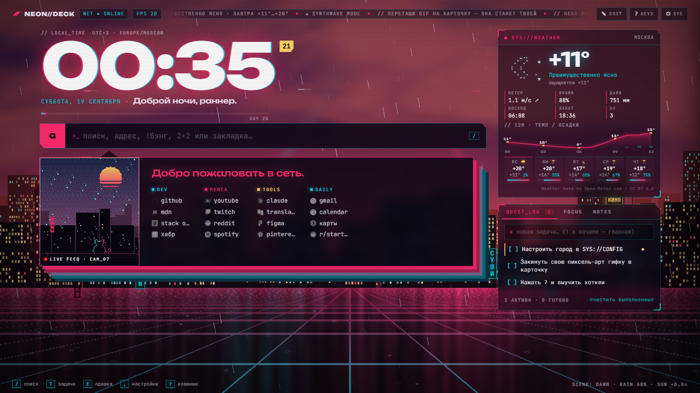

# NEON//DECK — киберпанк-новая вкладка для Firefox

Живая сцена (WebGL-небо + неоновый город) и HUD-панели поверх неё.



## Что внутри

**Сцена**
- Небо идёт по настоящему солнцу твоего города: восход и закат берутся из прогноза. Днём небо голубое, на закате синтвейв-солнце в полоску, ночью звёзды и луна.
- Погода в сцене тоже настоящая: дождь с брызгами и мокрым полом, гроза с молниями, снег, туман, облака.
- Три слоя города с параллаксом от мыши, мигающие окна, неоновые вывески, огни на антеннах, прожектора, летающий трафик.
- CRT-сканлайны, шум плёнки, глитч. Всё отключается в настройках.

**Поиск** (`/` или просто начни печатать)
- 6 поисковиков, `Tab` на пустой строке переключает.
- Бэнги: `!y котики` или `котики !y`. Список редактируется.
- `r/startpages` ведёт на сабреддит, `github.com` открывает адрес напрямую.
- Калькулятор: `(2+3)^2*1,5`, Enter копирует результат.
- Нечёткий поиск по закладкам и история запросов.

**Карточка с закладками** (в духе yet-another-generic-startpage)
- Слева картинка. По умолчанию это живая пиксельная сцена: котик на крыше, которая реагирует на время суток и погоду.
- Перетащи на карточку свою картинку или GIF, и она попадёт в галерею. На каждой вкладке показывается случайная картинка, клик переключает на следующую.
- Группы закладок. `E` включает режим правки: можно добавлять, переименовывать и перетаскивать между группами.
- Клавиши `1`–`9` открывают закладки по номеру.
- Импорт папок с панели закладок Firefox.

**Боковая колонка**
- Погода (open-meteo, ключ не нужен): ASCII-арт, показатели, график на 12 часов, прогноз на 5 дней.
- QUEST_LOG: задачи. `!` в начале делает задачу главной, порядок меняется перетаскиванием, двойной клик открывает правку.
- FOCUS: помодоро, общий для всех вкладок и не сбрасывается при закрытии.
- NOTES: заметки с автосохранением.

**Прочее:** 6 тем, лента новостей, загрузочный экран, звуки интерфейса (выключены по умолчанию), свой CSS, экспорт и импорт всех данных в JSON.

## Установка

### Быстро, до перезапуска Firefox
1. Открой `about:debugging#/runtime/this-firefox`
2. Нажми **«Загрузить временное дополнение…»** и выбери `manifest.json` из этой папки
3. Открой новую вкладку

### Навсегда
Обычный Firefox ставит только подписанные дополнения. Подписать можно бесплатно и без публикации в каталоге:
1. Собери архив, получится `dist/neon-deck.zip`:
   ```powershell
   powershell -ExecutionPolicy Bypass -File build.ps1
   ```
2. Зайди на https://addons.mozilla.org/developers/addon/submit/distribution
3. Выбери **«On your own»** (unlisted) и загрузи zip. Автоматическая проверка обычно занимает несколько минут.
4. Скачай подписанный `.xpi` и перетащи его в окно Firefox

*Альтернатива:* в Firefox Developer Edition или Nightly поставь в `about:config` значение `xpinstall.signatures.required = false` и ставь zip без подписи.

## Первые шаги
- Нажми `,`, чтобы открыть настройки. Там задаются имя, город (поиск или геолокация) и тема.
- Firefox при открытии вкладки ставит курсор в адресную строку. Кликни по странице или нажми `/`, и дальше горячие клавиши работают.
- Данные хранятся в `browser.storage` расширения. Перед переустановкой сделай экспорт.

## Горячие клавиши
| Клавиша | Действие |
|---|---|
| `/` | поиск |
| `T` | новая задача |
| `E` | правка закладок |
| `I` | следующая картинка |
| `1`–`9` | открыть закладку |
| `,` | настройки |
| `?` | шпаргалка |
| `Esc` | закрыть всё |

## Лицензия
© 2026 [Frnllk](https://github.com/Frnllk). Код распространяется по лицензии [GNU GPL v3](LICENSE): его можно использовать, менять и распространять, но производные работы тоже должны выходить под GPL v3 с открытым исходным кодом. Шрифты идут по лицензии SIL OFL 1.1. Какие данные и куда уходят из расширения, описано в [THIRD_PARTY_NOTICES.md](THIRD_PARTY_NOTICES.md).
